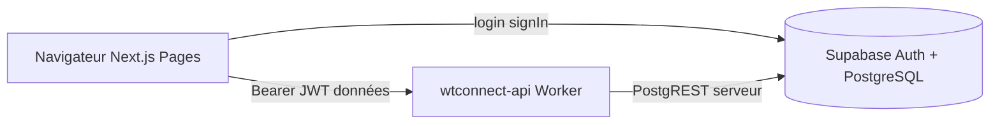

# Architecture — wtconnect-web

## Vue 3 tiers



| Composant | Hébergement | Repo |
|-----------|-------------|------|
| Front (ce repo) | Cloudflare Pages | `wtconnect-web` |
| API | Cloudflare Worker | `wtconnect-api` |
| BDD | Supabase compte B | migrations dans `wtconnect-api` |

## Règles front

1. **Auth phase 1** : `@supabase/supabase-js` uniquement dans `src/lib/auth-client.ts` (session, login).
2. **Données métier** : `apiFetch()` → `NEXT_PUBLIC_API_URL` (`/connect/messages`, `/connect/tenants`, …).
3. **Interdit** : `supabase.from()`, `rest/v1`, service role, `DATABASE_URL`.

## Build Pages

```bash
npm run build
# Output : .next (adapter static export ou @cloudflare/next-on-pages selon votre choix)
```

Variable obligatoire : `NEXT_PUBLIC_API_URL=https://api.[domaine]`

## Vérification DevTools

Après login, filtrer le réseau : aucun appel vers `*.supabase.co/rest/v1/` pour les tables métier. Seuls `auth/v1` (login) et votre domaine API sont attendus.
